# Awesome Post-Training RL for LLMs

LLM（大语言模型）**后训练强化学习**精选论文清单 —— 从 RLHF 奠基，到偏好优化（DPO 系）与 RL 训练框架（GRPO 系），再到推理 RL 里程碑、前沿模型技术报告、多智能体自博弈与智能体 RL。

## 目录

1. RLHF 奠基（Foundations of RLHF）
2. 偏好优化 · DPO 系（Preference Optimization · DPO Family）
3. RL 训练框架 · GRPO 系（RL Training Frameworks · GRPO Family）
4. 推理 RL 里程碑（Reasoning RL Milestones）
5. 前沿模型技术报告（Frontier Model Technical Reports）
6. 已录用顶会（Accepted at Top Conferences）
7. 多智能体 RL 与自博弈（Multi-Agent RL & Self-Play）
8. 智能体 RL · 多轮交互与工具使用（Agentic RL · Multi-Turn & Tool Use）
9. 贡献（Contributing）

## 总览

| 分类 | 论文数 | 代表方法 |
|---|---|---|
| RLHF 奠基 | 3 | PPO, RLAIF |
| 偏好优化 · DPO 系 | 8 | DPO, SPIN, KTO, ORPO, SimPO |
| RL 训练框架 · GRPO 系 | 18 | GRPO, RLOO, RLVR, DAPO |
| 推理 RL 里程碑 | 3 | R1-Zero, 长 CoT |
| 前沿模型技术报告 | 3 | GLM-5, DeepSeek-V4, Kimi K3 |
| 已录用顶会 | 4 | ACL 2026, ICLR 2026 |
| 多智能体 RL 与自博弈 | 8 | SPPO, MACPO, 自博弈, 协同演化 |
| 智能体 RL · 多轮交互与工具使用 | 8 | ARPO, SWEET-RL, AgentGym-RL, CAPO |
| **合计** | **55** | |

---

## 1. RLHF 奠基（Foundations of RLHF）

一切的开端：监督微调、奖励建模与强化学习的经典流程。

- **[Training language models to follow instructions with human feedback](https://arxiv.org/abs/2203.02155)** — Long Ouyang, Jeff Wu, Xu Jiang, Diogo Almeida, Carroll L. Wainwright, Pamela Mishkin, Chong Zhang, Sandhini Agarwal, Katarina Slama, Alex Ray, John Schulman, Jacob Hilton, Fraser Kelton, Luke Miller, Maddie Simens, Amanda Askell, Peter Welinder, Paul Christiano, Jan Leike, Ryan Lowe. *NeurIPS 2022*. 开创性的 **InstructGPT** 工作，提出 RLHF 流程：SFT → 奖励建模 → PPO，使 GPT-3 遵循人类指令。
- **[Constitutional AI: Harmlessness from AI Feedback](https://arxiv.org/abs/2212.08073)** — Yuntao Bai, Saurav Kadavath, Sandipan Kundu, Amanda Askell, Jackson Kernion, Andy Jones, Anna Chen, Anna Goldie, Azalia Mirhoseini, Cameron McKinnon, Carol Chen, Catherine Olsson, Christopher Olah, Danny Hernandez, Dawn Drain, Deep Ganguli, Dustin Li, Eli Tran-Johnson, Ethan Perez, Jamie Kerr, Jared Mueller, Jeffrey Ladish, Joshua Landau, Kamal Ndousse, Kamile Lukosuite, Liane Lovitt, Michael Sellitto, Nelson Elhage, Nicholas Schiefer, Noemi Mercado, Nova DasSarma, Robert Lasenby, Robin Larson, Sam Ringer, Scott Johnston, Shauna Kravec, Sheer El Showk, Stanislav Fort, Tamera Lanham, Timothy Telleen-Lawton, Tom Conerly, Tom Henighan, Tristan Hume, Samuel R. Bowman, Zac Hatfield-Dodds, Ben Mann, Dario Amodei, Nicholas Joseph, Sam McCandlish, Tom Brown, Jared Kaplan. *2022*. 通过 **RLAIF**（AI 反馈）训练无害助手，用一套书面「宪法」原则替代人工标注。
- **[RLAIF vs. RLHF: Scaling Reinforcement Learning from Human Feedback with AI Feedback](https://arxiv.org/abs/2309.00267)** — Harrison Lee, Samrat Phatale, Hassan Mansoor, Thomas Mesnard, Johan Ferret, Kellie Lu, Colton Bishop, Ethan Hall, Victor Carbune, Abhinav Rastogi, Sushant Prakash. *ICML 2024*. 证明 AI 生成的偏好可与人类偏好相媲美，使对齐可扩展到人工标注之外。

## 2. 偏好优化 · DPO 系（Preference Optimization · DPO Family）

绕过奖励模型 + PPO 的直接 / 闭式对齐目标。

- **[Direct Preference Optimization: Your Language Model is Secretly a Reward Model](https://arxiv.org/abs/2305.18290)** — Rafael Rafailov, Archit Sharma, Eric Mitchell, Stefano Ermon, Christopher D. Manning, Chelsea Finn. *NeurIPS 2023*. **DPO** 用单一闭式目标在偏好对上直接训练，取代奖励模型 + PPO 流程。 · [code](https://github.com/eric-mitchell/direct-preference-optimization)
- **[Self-Play Fine-Tuning Converts Weak Language Models to Strong Language Models](https://arxiv.org/abs/2401.01335)** — Zixiang Chen, Yihe Deng, Huizhuo Yuan, Kaixuan Ji, Quanquan Gu. *ICML 2024*. **SPIN** 自博弈微调，用模型自身生成的回答作为偏好对的「负样本」来迭代精炼。
- **[Self-Rewarding Language Models](https://arxiv.org/abs/2401.10020)** — Weizhe Yuan, Richard Yuanzhe Pang, Kyunghyun Cho, Xian Li, Sainbayar Sukhbaatar, Jing Xu, Jason Weston. *2024*. 训练 LLM 充当自己的评判者（**LLM-as-a-Judge**），迭代提升指令遵循与奖励建模。
- **[KTO: Model Alignment as Prospect Theoretic Optimization](https://arxiv.org/abs/2402.01306)** — Kawin Ethayarajh, Winnie Xu, Niklas Muennighoff, Dan Jurafsky, Douwe Kiela. *ICML 2024*. 基于前景理论的二元好 / 坏信号对齐，无需成对偏好，降低数据需求。
- **[ORPO: Monolithic Preference Optimization without Reference Model](https://arxiv.org/abs/2403.07691)** — Jiwoo Hong, Noah Lee, James Thorne. *ACL 2024*. 无参考模型的一体式偏好优化，将 SFT 与对齐融合为一个训练阶段。
- **[SimPO: Simple Preference Optimization with a Reference-Free Reward](https://arxiv.org/abs/2405.14734)** — Yu Meng, Mengzhou Xia, Danqi Chen. *NeurIPS 2024*. 基于平均对数概率的无参考奖励，配合长度归一化与目标奖励边际。
- **[Nemotron-4 340B Technical Report](https://arxiv.org/abs/2406.11704)** — NVIDIA. *2024*. 开放的 340B 基座 / 指令 / 奖励模型，展示 HelpSteer2 奖励建模与迭代 DPO 对齐。
- **[GDPO: Group reward-Decoupled Normalization Policy Optimization for Multi-reward RL Optimization](https://arxiv.org/abs/2601.05242)** — Shih-Yang Liu, Xin Dong, Ximing Lu, Shizhe Diao, Peter Belcak, Mingjie Liu, Min-Hung Chen, Hongxu Yin, Yu-Chiang Frank Wang, Kwang-Ting Cheng, Yejin Choi, Jan Kautz, Pavlo Molchanov. *2026*. 按组解耦多奖励信号并归一化后再优化，稳定多目标 RL。

## 3. RL 训练框架 · GRPO 系（RL Training Frameworks · GRPO Family）

围绕 GRPO 及其变体的无 critic 策略梯度方法、训练系统与效率 / 稳定性技巧。

- **[DeepSeekMath: Pushing the Limits of Mathematical Reasoning in Open Language Models](https://arxiv.org/abs/2402.03300)** — Zhihong Shao, Peiyi Wang, Qihao Zhu, Runxin Xu, Junxiao Song, Xiao Bi, Haowei Zhang, Mingchuan Zhang, Y. K. Li, Y. Wu, Daya Guo. *2024*. 提出 **GRPO**（组相对策略优化）用于数学推理，去除了 critic 模型。 · [code](https://github.com/deepseek-ai/DeepSeek-Math)
- **[Teaching Large Language Models to Reason with Reinforcement Learning](https://arxiv.org/abs/2403.04642)** — Alex Havrilla, Yuqing Du, Sharath Chandra Raparthy, Christoforos Nalmpantis, Jane Dwivedi-Yu, Maksym Zhuravinskyi, Eric Hambro, Sainbayar Sukhbaatar, Roberta Raileanu. *2024*. 「回到基础」—— 强调 **RLOO** 作为 PPO 的简单低方差替代，并探索无冷启动 SFT 的 RL。
- **[Tulu 3: Pushing Frontiers in Open Language Model Post-Training](https://arxiv.org/abs/2411.15124)** — Nathan Lambert, Jacob Morrison, Valentina Pyatkin, Shengyi Huang, Hamish Ivison, Faeze Brahman, Lester James V. Miranda, Alisa Liu, Nouha Dziri, Shane Lyu, Yuling Gu, Saumya Malik, Victoria Graf, Jena D. Hwang, Jiangjiang Yang, Ronan Le Bras, Oyvind Tafjord, Chris Wilhelm, Luca Soldaini, Noah A. Smith, Yizhong Wang, Pradeep Dasigi, Hannaneh Hajishirzi. *2024*. 完全开放的后训练配方（SFT → DPO → **RLVR**），含基础设施、数据与评测。 · [code](https://github.com/allenai/open-instruct)
- **[REINFORCE++: Stabilizing Critic-Free Policy Optimization with Global Advantage Normalization](https://arxiv.org/abs/2501.03262)** — Jian Hu, Jason Klein Liu, Haotian Xu, Wei Shen. *2025*. 通过全局优势归一化稳定无 critic 的策略优化，改进 GRPO 式训练。
- **[DAPO: An Open-Source LLM Reinforcement Learning System at Scale](https://arxiv.org/abs/2503.14476)** — Qiying Yu, Zheng Zhang, Ruofei Zhu, Yufeng Yuan, Xiaochen Zuo, Yu Yue, Weinan Dai, Tiantian Fan, Gaohong Liu, Lingjun Liu, Xin Liu, Haibin Lin, Zhiqi Lin, Bole Ma, Guangming Sheng, Yuxuan Tong, Chi Zhang, Mofan Zhang, Wang Zhang, Hang Zhu, Jinhua Zhu, Jiaze Chen, Jiangjie Chen, Chengyi Wang, Hongli Yu, Yuxuan Song, Xiangpeng Wei, Hao Zhou, Jingjing Liu, Wei-Ying Ma, Ya-Qin Zhang, Lin Yan, Mu Qiao, Yonghui Wu, Mingxuan Wang. *2025*. 开源大规模 RL 系统，通过解耦 clip-higher 与动态采样修复 GRPO 的熵坍缩问题。
- **[GRPO-CARE: Consistency-Aware Reinforcement Learning for Multimodal Reasoning](https://arxiv.org/abs/2506.16141)** — Yi Chen, Yuying Ge, Rui Wang, Yixiao Ge, Junhao Cheng, Ying Shan, Xihui Liu. *2025*. 为 GRPO 增加一致性感知目标，缓解多模态推理中的幻觉。
- **[STAPO: Stabilizing Reinforcement Learning for LLMs by Silencing Rare Spurious Tokens](https://arxiv.org/abs/2602.15620)** — Shiqi Liu, Zeyu He, Guojian Zhan, Letian Tao, Zhilong Zheng, Jiang Wu, Yinuo Wang, Yang Guan, Kehua Sheng, Bo Zhang, Keqiang Li, Jingliang Duan, Shengbo Eben Li. *2026*. 在策略更新时屏蔽罕见的高方差虚假 token，稳定 RL 训练。
- **[Buffer Matters: Unleashing the Power of Off-Policy Reinforcement Learning in Large Language Model Reasoning](https://arxiv.org/abs/2602.20722)** — Xu Wan, Yansheng Wang, Wenqi Huang, Mingyang Sun. *2026*. **BAPO** 离策略 RLVR：复用历史 rollout 且保有改进下界，平均超 GRPO 12.5%。
  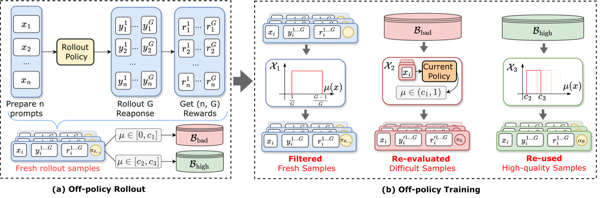
- **[Do Post-Training Algorithms Actually Differ? A Controlled Study Across Model Scales Uncovers Scale-Dependent Ranking Inversions](https://arxiv.org/abs/2603.19335)** — Xiaoyi Li. *2026*. 受控研究表明后训练算法排名会随模型规模反转。
- **[Efficient RL Training for LLMs with Experience Replay](https://arxiv.org/abs/2604.08706)** — Charles Arnal, Vivien Cabannes, Taco Cohen, Julia Kempe, Remi Munos. *2026*. 将经验回放引入 LLM RL，实现样本高效地复用历史 rollout。
- **[Understanding and Preventing Entropy Collapse in RLVR with On-Policy Entropy Flow Optimization](https://arxiv.org/abs/2605.11491)** — Huimin Xu, Shuai Zhao, Xiaobao Wu, Anh Tuan Luu. *2026*. 把熵坍缩归因于 token 级**熵流**失衡；**OPEFO** 重缩放升降熵更新，严格同策略。
  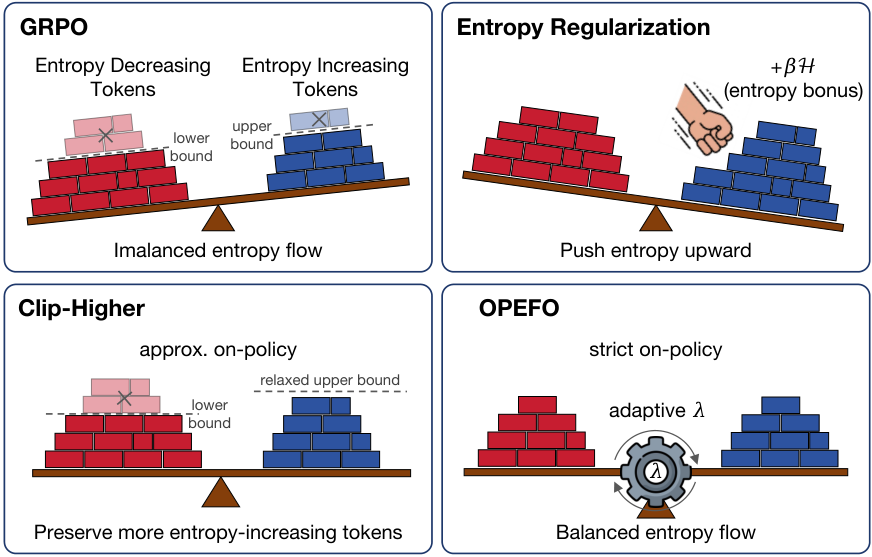
- **[DACA-GRPO: Denoising-Aware Credit Assignment for Reinforcement Learning in Diffusion Language Models](https://arxiv.org/abs/2605.16342)** — Amin Karimi Monsefi, Dominic Culver, Nikhil Bhendawade, Lokesh Boominathan, Manuel R. Ciosici, Yizhe Zhang, Irina Belousova. *2026*. 扩散语言模型中 GRPO 的去噪感知信用分配。
- **[PopuLoRA: Co-Evolving LLM Populations for Reasoning Self-Play](https://arxiv.org/abs/2605.16727)** — Roger Creus Castanyer, Geoffrey Bradway, Lorenz Wolf, Maxwill Lin, Augustine N. Mavor-Parker, Matthew James Sargent. *2026*. 通过自博弈协同演化 LoRA 模块种群以增强推理。
- **[How Off-Policy Can GRPO Be? Mu-GRPO for Efficient LLM Reinforcement Learning](https://arxiv.org/abs/2605.17570)** — Minghao Tian, Yunfei Xie, Chen Wei. *2026*. 探究 GRPO 的离策略程度，跨多次更新复用 rollout 提升效率。
- **[Spend Your Rollouts Where It Counts: Rollout Allocation for Group-Based RL Post-Training](https://arxiv.org/abs/2605.26606)** — Woojeong Kim, Ziyi Yang, Jing Nathan Yan, Jialu Liu. *2026*. 动态分配 rollout 预算到最能提升组式 RL 之处。
- **[Smart Picks in the Dark: Towards Efficient RLVR for Reasoning via Tracing Metacognitive Pivots](https://arxiv.org/abs/2606.04503)** — Guangcheng Zhu, Shenzhi Yang, Haobo Wang, Xing Zheng, Yingfan Ma, Xuening Feng, Zhongqi Chen, Bowen Song, Weiqiang Wang, Gang Chen. *2026*. **PivotTrace** 用注意力动态分流无标注数据，29.3% 标注即超越全数据 RLVR。
  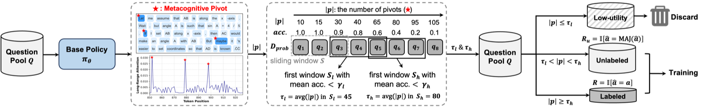
- **[Rollout-Level Advantage-Prioritized Experience Replay for GRPO](https://arxiv.org/abs/2606.04560)** — Gyeongtae Yoo, Sanghyeok Park, Soohyuk Jang, Ik-hwan Kim, Sungroh Yoon. *2026*. GRPO 的 rollout 级经验回放：年龄淘汰 + 优势优先回放。
  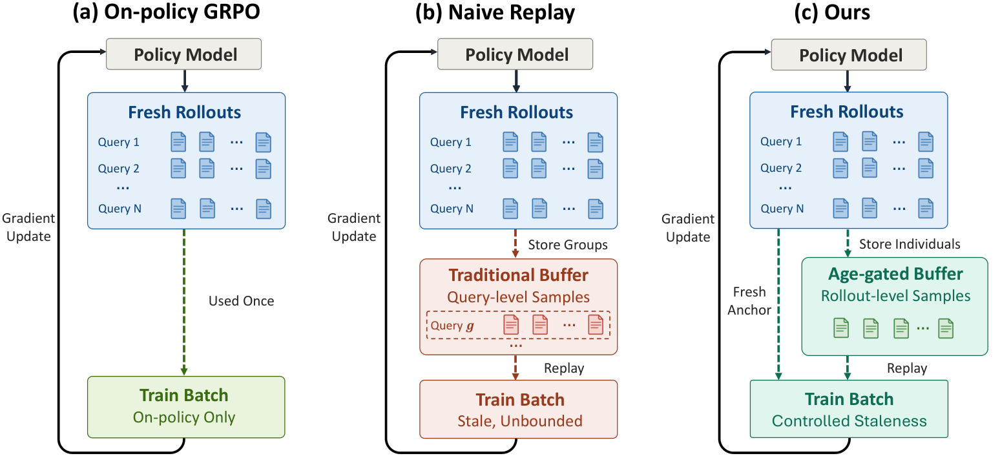
- **[Distilled Reinforcement Learning for LLM Post-training](https://arxiv.org/abs/2607.17247)** — Chen Wang, Zhaochun Li, Jionghao Bai, Yining Zhang, Hexuan Deng, Ge Lan, Yue Wang. *2026*. 将 RL 后训练信号蒸馏为高效的 LLM 对齐。

## 4. 推理 RL 里程碑（Reasoning RL Milestones）

展示仅靠 RL 即可解锁涌现推理能力的里程碑模型。

- **[Kimi k1.5: Scaling Reinforcement Learning with LLMs](https://arxiv.org/abs/2501.12599)** — Kimi Team. *2025*. 通过 RL（长 CoT、RLVR、课程、long2short）扩展，媲美前沿推理模型。 · [code](https://github.com/MoonshotAI/Kimi-k1.5)
- **[DeepSeek-R1: Incentivizing Reasoning Capability in LLMs via Reinforcement Learning](https://arxiv.org/abs/2501.12948)** — DeepSeek-AI. *2025*. 纯 RL 的「顿悟时刻」（**R1-Zero**），再到多阶段 **R1** 流程与蒸馏开源模型。 · [code](https://github.com/deepseek-ai/DeepSeek-R1)
- **[Open-Reasoner-Zero: An Open Source Approach to Scaling Up Reinforcement Learning on the Base Model](https://arxiv.org/abs/2503.24290)** — Jingcheng Hu, Yinmin Zhang, Qi Han, Daxin Jiang, Xiangyu Zhang, Heung-Yeung Shum. *2025*. 开源复现 R1-Zero 式的基座模型 RL 扩展，取得强推理能力。 · [code](https://github.com/Open-Reasoner-Zero/Open-Reasoner-Zero)

## 5. 前沿模型技术报告（Frontier Model Technical Reports）

近期前沿模型的规模化后训练报告。

- **[GLM-5: from Vibe Coding to Agentic Engineering](https://arxiv.org/abs/2602.15763)** — GLM-5-Team（智谱 AI & 清华）. *2026*. 前沿智能体 LLM，强调智能体工程与工具使用后训练。
- **[DeepSeek-V4: Towards Highly Efficient Million-Token Context Intelligence](https://arxiv.org/abs/2606.19348)** — DeepSeek-AI. *2026*. 关于高效百万 token 上下文模型的前沿报告。
- **[Kimi K3: Open Frontier Intelligence](https://arxiv.org/abs/2607.24653)** — Kimi Team. *2026*. 开源前沿智能模型报告。

## 6. 已录用顶会（Accepted at Top Conferences）

被顶级会议收录的论文。

- **[Scaling Behaviors of LLM Reinforcement Learning Post-Training: An Empirical Study in Mathematical Reasoning](https://arxiv.org/abs/2509.25300)** — Zelin Tan, Hejia Geng, Xiaohang Yu, Mulei Zhang, Guancheng Wan, Yifan Zhou, Qiang He, Xiangyuan Xue, Heng Zhou, Yutao Fan, Zhongzhi Li, Zaibin Zhang, Guibin Zhang, Chen Zhang, Zhenfei Yin, Philip Torr, Lei Bai. *ACL 2026 Main Conference*. 数学推理中 RL 后训练的经验缩放规律研究。 · [code](https://github.com/tanzelin430/The-Scaling-Law-for-Reinforcement-Learning)
- **[Nudging the Boundaries of LLM Reasoning](https://arxiv.org/abs/2509.25666)** — Justin Chih-Yao Chen, Becky Xiangyu Peng, Prafulla Kumar Choubey, Kung-Hsiang Huang, Jiaxin Zhang, Mohit Bansal, Chien-Sheng Wu. *ICLR 2026*. **NuRL** —— 通过「轻推」式 RL 干预突破 LLM 推理边界。
- **[Training Large Reasoning Models Efficiently via Progressive Thought Encoding](https://arxiv.org/abs/2602.16839)** — Zeliang Zhang, Xiaodong Liu, Hao Cheng, Hao Sun, Chenliang Xu, Jianfeng Gao. *ICLR 2026*. 渐进式思维编码，高效训练大推理模型。
- **[Why Does Reinforcement Learning Generalize? A Feature-Level Mechanistic Study of Post-Training in Large Language Models](https://arxiv.org/abs/2604.25011)** — Dan Shi, Zhuowen Han, Simon Ostermann, Renren Jin, Josef van Genabith, Deyi Xiong. *ACL 2026 Main Conference*. 特征级机制研究：RL 为何在 LLM 后训练中能泛化。

## 7. 多智能体 RL 与自博弈（Multi-Agent RL & Self-Play）

面向 LLM 后训练与推理的多智能体自博弈、辩论与协同演化。（另见 §3 中的 PopuLoRA。）

- **[Self-Play Preference Optimization for Language Model Alignment](https://arxiv.org/abs/2405.00675)** — Yue Wu, Zhiqing Sun, Huizhuo Yuan, Kaixuan Ji, Yiming Yang, Quanquan Gu. *ICLR 2025*. **SPPO** 将偏好优化建模为双人零和博弈，通过迭代自博弈收敛到纳什均衡，无需外部监督。 · [code](https://github.com/uclaml/SPPO)
- **[MACPO: Weak-to-Strong Alignment via Multi-Agent Contrastive Preference Optimization](https://arxiv.org/abs/2410.07672)** — Yougang Lyu, Lingyong Yan, Zihan Wang, Dawei Yin, Pengjie Ren, Maarten de Rijke, Zhaochun Ren. *ICLR 2025*. 弱教师与强学生通过正向行为增强与难负样本构建相互学习，实现弱到强对齐。
- **[Self-Improvement of Language Models by Post-Training on Multi-Agent Debate](https://arxiv.org/abs/2509.15172)** — Ankur Samanta, Akshayaa Magesh, Runzhe Wu, Ayush Jain, Youliang Yu, Daniel Jiang, Boris Vidolov, Paul Sajda, Yonathan Efroni, Kaveh Hassani. *2025*. 在多智能体辩论轨迹上后训练单一 LM，使其内化多智能体辩论带来的提升。
- **[OPTAGENT: Optimizing Multi-Agent LLM Interactions Through Verbal Reinforcement Learning for Enhanced Reasoning](https://arxiv.org/abs/2510.18032)** — Zhenyu Bi, Meng Lu, Yang Li, Swastik Roy, Weijie Guan, Morteza Ziyadi, Xuan Wang. *2025*. 言语 RL，通过评估辩论中的通信质量动态构建与精炼多智能体协作结构。
- **[Tool-R0: Self-Evolving LLM Agents for Tool-Learning from Zero Data](https://arxiv.org/abs/2602.21320)** — Emre Can Acikgoz, Cheng Qian, Jonas Hübotter, Heng Ji, Dilek Hakkani-Tür, Gokhan Tur. *2026*. 面向工具调用智能体的零数据自博弈，以难度引导奖励协同演化生成器与求解器。
- **[SAGE: Multi-Agent Self-Evolution for LLM Reasoning](https://arxiv.org/abs/2603.15255)** — Yulin Peng, Xinxin Zhu, Chenxing Wei, Nianbo Zeng, Leilei Wang, Ying Tiffany He, F. Richard Yu. *2026*. 挑战者 / 规划者 / 求解者 / 评判者四角色共享一个主干协同演化，用评判者防止课程漂移。
- **[EvoTrainer: Co-Evolving LLM Policies and Training Harnesses for Autonomous Agentic Reinforcement Learning](https://arxiv.org/abs/2606.03108)** — Guhong Chen, Yingcheng Shi, Yongbin Li, Binhua Li, Xander Xu, Hu Wei, Shiwen Ni, Min Yang, Jieping Ye. *2026*. 通过经验反馈协同演化 LLM 策略与训练工具链，积累可复用技能。
- **[J-Zero: Unified Challenger–Solver–Judge Co-Evolution from Zero Data](https://arxiv.org/abs/2608.26582)** — Gyouk Chu, Myeongho Jeon, Eunho Yang. *2026*. 挑战者–求解者–评判者从零数据的统一协同演化。 · [code](https://github.com/GyoukChu/J-Zero)

## 8. 智能体 RL · 多轮交互与工具使用（Agentic RL · Multi-Turn & Tool Use）

面向多轮、长程 LLM 智能体的 RL：工具调用、跨轮信用分配与训练框架。

- **[SWEET-RL: Training Multi-Turn LLM Agents on Collaborative Reasoning Tasks](https://arxiv.org/abs/2503.15478)** — Yifei Zhou, Song Jiang, Yuandong Tian, Jason Weston, Sergey Levine, Sainbayar Sukhbaatar, Xian Li. *2025*. **ColBench** 基准；可利用训练时信息的 critic 给出**步级奖励**，解决多轮信用分配。
  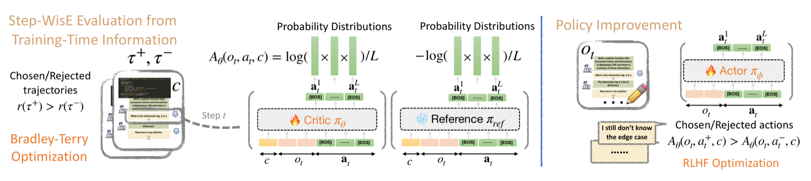
- **[Agentic Reinforced Policy Optimization](https://arxiv.org/abs/2507.19849)** — Guanting Dong, Hangyu Mao, Kai Ma, Licheng Bao, Yifei Chen, Zhongyuan Wang, Zhongxia Chen, Jiazhen Du, Huiyang Wang, Fuzheng Zhang, Guorui Zhou, Yutao Zhu, Ji-Rong Wen, Zhicheng Dou. *2025*. **ARPO** 以熵驱动的自适应 rollout 平衡长程推理与多轮工具交互，工具调用预算减半。 · [code](https://github.com/dongguanting/ARPO)
  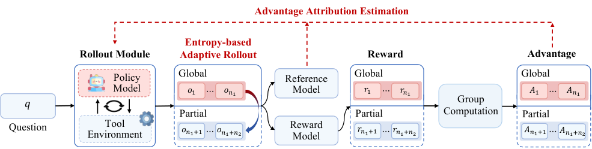
- **[The Landscape of Agentic Reinforcement Learning for LLMs: A Survey](https://arxiv.org/abs/2509.02547)** — Guibin Zhang, Hejia Geng, Xiaohang Yu, Zhenfei Yin, Zaibin Zhang, Zelin Tan, Heng Zhou, Zhongzhi Li, Xiangyuan Xue, Yijiang Li, Yifan Zhou, Yang Chen, Chen Zhang, Yutao Fan, Zihu Wang, Songtao Huang, Francisco Piedrahita-Velez, Yue Liao, Hongru Wang, Mengyue Yang, Heng Ji, Jun Wang, Shuicheng Yan, Philip Torr, Lei Bai. *2025*. 综述五百余项工作，把 **Agentic RL** 界定为单步 MDP 到 POMDP 的范式转变。
  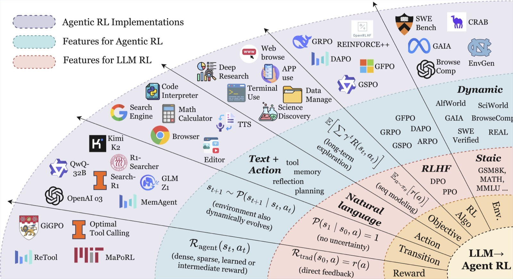
- **[AgentGym-RL: Training LLM Agents for Long-Horizon Decision Making through Multi-Turn Reinforcement Learning](https://arxiv.org/abs/2509.08755)** — Zhiheng Xi, Jixuan Huang, Chenyang Liao, Baodai Huang, Honglin Guo, Jiaqi Liu, Rui Zheng, Junjie Ye, Jiazheng Zhang, Wenxiang Chen, Wei He, Yiwen Ding, Guanyu Li, Zehui Chen, Zhengyin Du, Xuesong Yao, Yufei Xu, Jiecao Chen, Tao Gui, Zuxuan Wu, Qi Zhang, Xuanjing Huang, Yu-Gang Jiang. *2025*. 无需 SFT 从零多轮 RL 的统一框架；**ScalingInter-RL** 渐进放宽交互轮数。 · [code](https://github.com/WooooDyy/AgentGym-RL)
  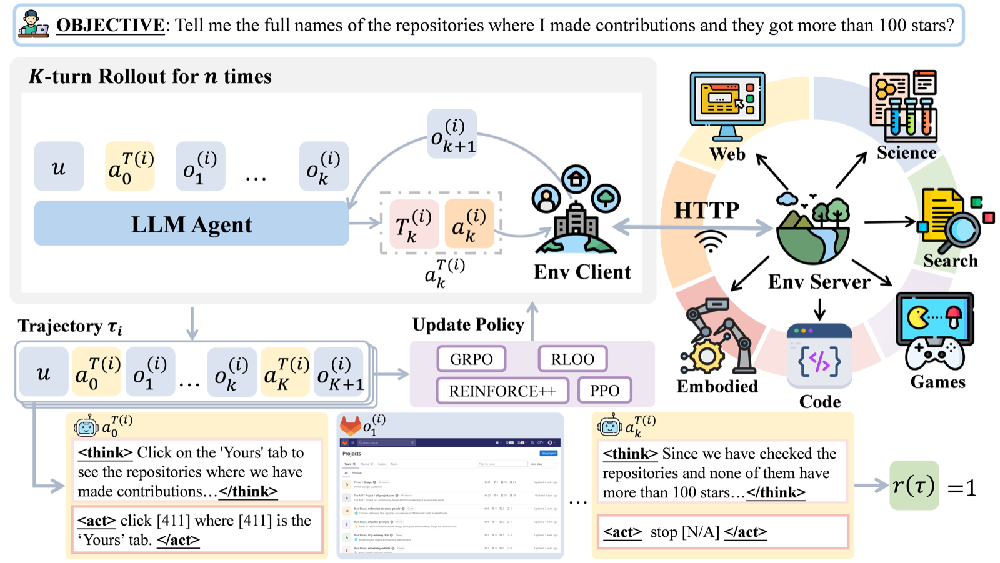
- **[SkyRL-Agent: Efficient RL Training for Multi-turn LLM Agent](https://arxiv.org/abs/2511.16108)** — Shiyi Cao, Dacheng Li, Fangzhou Zhao, Shuo Yuan, Sumanth R. Hegde, Connor Chen, Charlie Ruan, Tyler Griggs, Shu Liu, Eric Tang, Richard Liaw, Philipp Moritz, Matei Zaharia, Joseph E. Gonzalez, Ion Stoica. *2025*. 异步多轮训练框架；**SA-SWE-32B** 在 SWE-Bench Verified 达 39.4%，成本减半。 · [code](https://github.com/NovaSky-AI/SkyRL)
  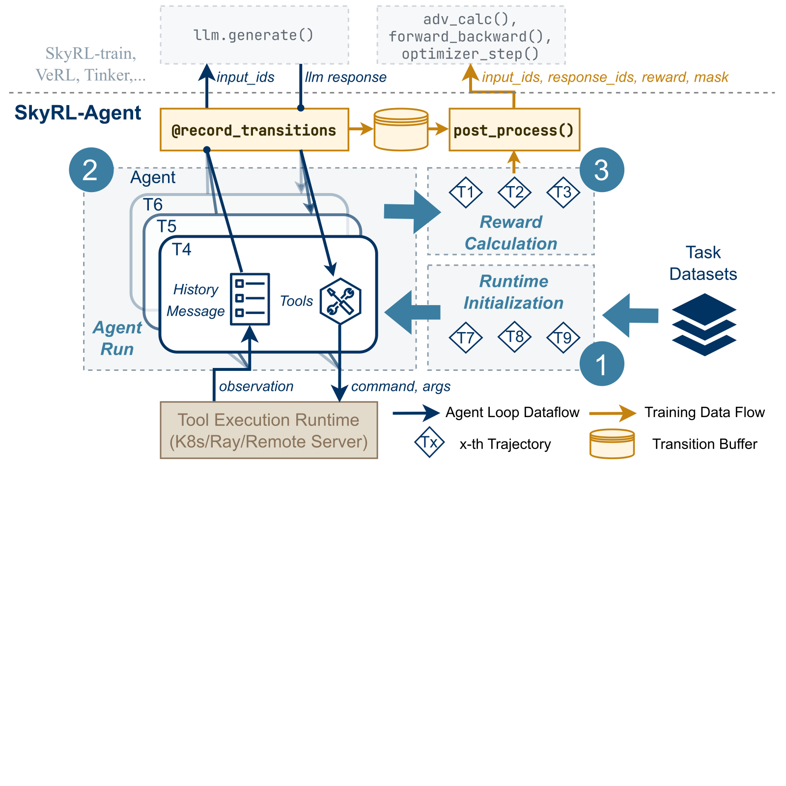
- **[Demystifying Reinforcement Learning for Long-Horizon Tool-Using Agents: A Comprehensive Recipe](https://arxiv.org/abs/2603.21972)** — Xixi Wu, Qianguo Sun, Ruiyang Zhang, Chao Song, Junlong Wu, Yiyan Qi, Hong Cheng. *2026*. 在 TravelPlanner 上做受控实验，蒸馏出 SOTA 的长程工具使用配方。
  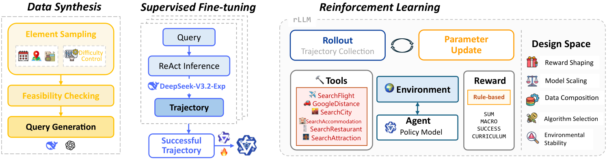
- **[From Reasoning to Agentic: Credit Assignment in Reinforcement Learning for Large Language Models](https://arxiv.org/abs/2604.09459)** — Chenchen Zhang. *2026*. 综述 69 种**信用分配**方法，覆盖 token / 步 / 工具调用粒度。
  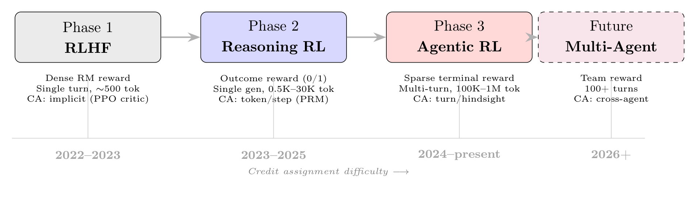
- **[CAPO: Critic-Guided Action-Aligned Policy Optimization for Advancing LLM Agent Capabilities](https://arxiv.org/abs/2604.18401)** — Daoyu Wang, Qingchuan Li, Mingyue Cheng, Jie Ouyang, Shuo Yu, Chunli Liu, Shijin Wang, Qi Liu, Enhong Chen. *2026*. **CAPO** 在动作边界估计价值并以动作对齐的比率更新，让信用落在整个动作上。
  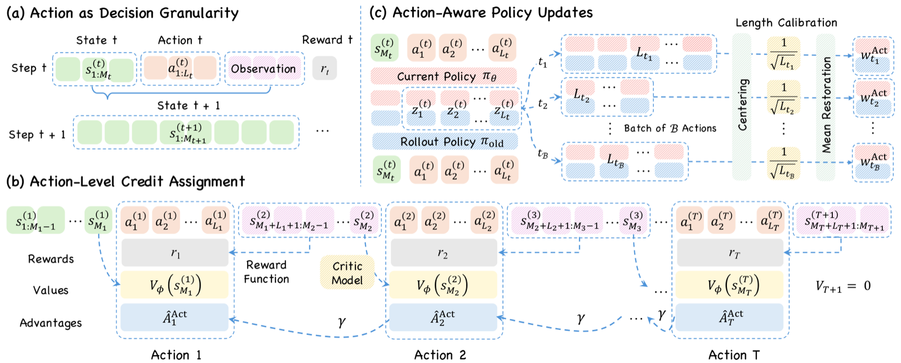

---

## 贡献（Contributing）

欢迎贡献！添加论文请提交 PR，要求：

1. 将条目放到最相关的章节（遵循现有格式）。
2. 链接 arXiv 摘要（或等价链接）。
3. 包含完整作者列表、会议（如有）、年份与一句话简介。
4. 存在官方实现时加上 `[code]` 链接。

详见 [CONTRIBUTING.md](./CONTRIBUTING.md)。

## 说明

- 所有链接指向 arXiv 摘要页；编号遵循 `YYMM.NNNNN` 规则。
- **会议**：被顶级会议收录时标注（NeurIPS / ICML / ICLR / ACL）；未标注的为 arXiv 预印本 / 技术报告。
- 机构级超大协作以团队名署名（DeepSeek-AI、Kimi Team、NVIDIA、GLM-5-Team），与论文原文一致。
- 部分论文的本地 PDF 存放于本仓库编号子文件夹中（文件夹名与章节标题对应）。
- 条目下方嵌入的核心图取自论文的 arXiv HTML 版本或官方仓库（见 [`figures/`](./figures/)）。

## 许可证（License）

[MIT License](./LICENSE) © 2026 [SergioTermann](https://github.com/SergioTermann)
